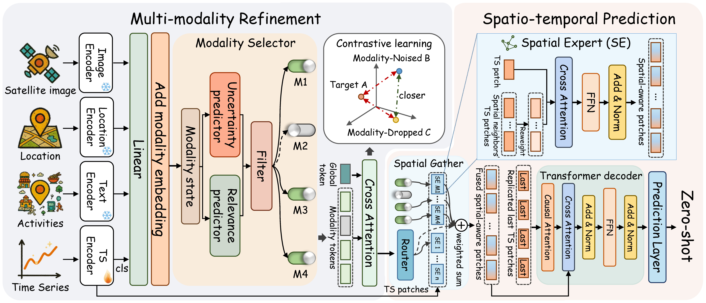

# MoST

This is the official repository of our KDD 2026 paper MoST: A Foundation Model for Multi-modality Spatio-temporal Traffic Prediction. MoST is designed to perform traffic prediction in previously unseen cities using any available modalities. 




## Getting Started

### Requirements
Our experimental environments include Python 3.8, Pytorch 2.4.1 with CUDA 12.4. To install all dependencies, please use the below command.
```
pip install -r requirements.txt
```

### Datasets
The traffic datasets can be obtained from the [Urban-Dataset](https://github.com/uctb/Urban-Dataset/tree/main) and [LargrST](https://www.kaggle.com/datasets/liuxu77/largest). The POI dataset can be obtained from [Foursquare](https://huggingface.co/datasets/foursquare/fsq-os-places). Satellite imagery is obtained from Google Earth Engine.

### Running

For example, the below command is used to train MoST. The example config file is "data_configs/most.yaml". The trained model can be used for inference by setting "--is_training 0".
```
python run.py --is_training 1 --gpu 0
```


## Citation
If you find our work useful in your research, please cite:
```
@inproceedings{xu2026most,
  title={MoST: A Foundation Model for Multi-modality Spatio-temporal Traffic Prediction},
  author={Xu, Ronghui and Chen, Jihao and Tian, Jingdong and Guo, Chenjuan and Yang, Bin},
  booktitle={SIGKDD}
  year={2026}
}
```